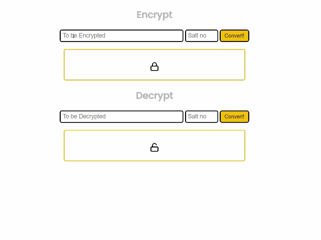

## Hashing Algo

This program uses custom programmed Algorithm which you can modify with Javascript knowledge and create own algorithm

## Encryption Guide
- Input your Text or Passcode into the Encrypt input box
- Choose a salting number
- Click on Convert

## Decryption Guide
- Input your encrypted result text into the Decrypt box
- Enter previous salt no while decrypting
- Click on Convert

## AI Overview

Check out a demo version of the AI on MetaTool

  

  

